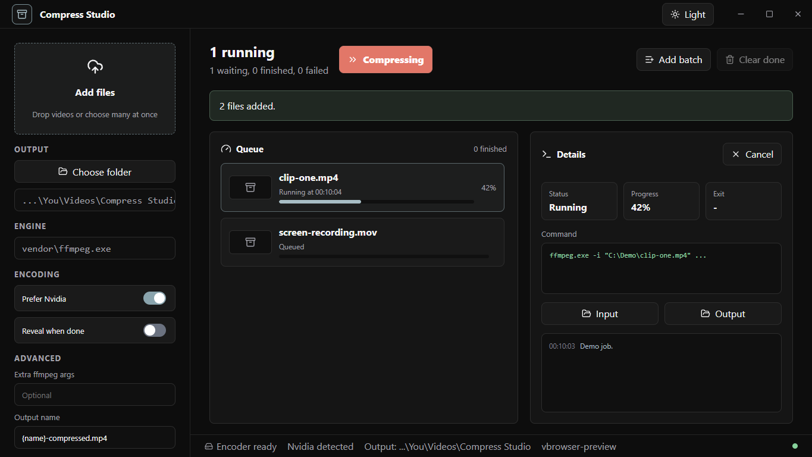
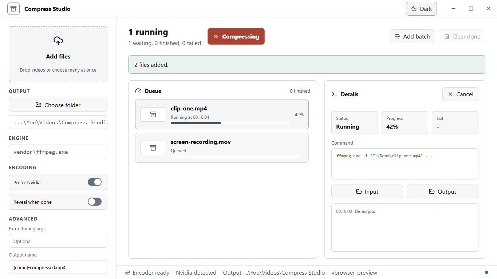

# Compress Studio

Compress Studio is a Windows-first desktop app for batch video compression. It keeps the Scrcpy Studio style system, window controls, and light/dark mode feel, but replaces the device tooling with a queue-based video compression workflow.

## Screenshots

### Dark mode



### Light mode



## Features

- Drag-and-drop or multi-select video files.
- Manual `Compress` start button so settings can be adjusted before jobs run.
- Queue thumbnails, progress bars, status, output size, and completed history.
- Output folder picker and output filename template.
- Nvidia preference with automatic hardware encoder detection.
- Optional desired final size target with max attempts.
- Parallel job control and reveal-on-done support.
- FFmpeg is provided by the `ffmpeg-static` npm dependency, so source builds do not need a system FFmpeg install.

## Install From Source

```powershell
git clone https://github.com/Roinur/Compress-studio.git
cd Compress-studio
npm install
npm run package
```

The Windows installer is written to `release/`.

## Development

```powershell
npm install
npm run dev
```

## Build

```powershell
npm run build
npm run package
```

The Windows installer is written to `release/`.

## FFmpeg

FFmpeg is installed by npm through [`ffmpeg-static`](https://www.npmjs.com/package/ffmpeg-static). A normal source build is:

```powershell
npm install
npm run package
```

The generated installer includes the FFmpeg binary from `node_modules/ffmpeg-static/`.

## Credits

This app is based on the Scrcpy Studio desktop shell/design and adapts it into a compression-focused app.

Compression behavior is based on [`k0rucha/8mb-videocompressor`](https://github.com/k0rucha/8mb-videocompressor), a Python/FFmpeg utility for compressing videos to 8MB or less. Compress Studio keeps the useful compression idea but implements it as a batch desktop UI with queue state, thumbnails, configurable output folders, desired-size targets, and background FFmpeg jobs.

FFmpeg is used for video encoding, thumbnail extraction, and metadata probing.
